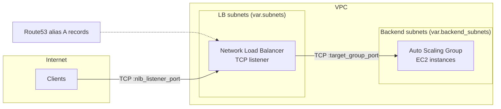

# Architecture

This document explains how the InfraHouse tcp-pod module works.

## Overview

A client resolves the service name via Route53, connects to the NLB on the listener port,
and the NLB forwards the TCP stream to a healthy instance in the Auto Scaling Group.

## Components

### Network Load Balancer

`lb.tf` creates the NLB, a TCP listener, and a target group.

- **Scheme is inferred, not configured**: the module checks `map_public_ip_on_launch` of the
  first subnet in `var.subnets`. Public subnets produce an internet-facing NLB, private
  subnets an internal one.
- **Name prefix**: the NLB and target group names start with the first 6 characters of
  `service_name` (or `nlb_name_prefix` if provided).
- **Stickiness**: the target group uses `source_ip` stickiness, so a client keeps talking
  to the same backend instance.
- **Health checks**: TCP by default on the traffic port; protocol, port, thresholds,
  interval, and timeout are configurable.

### Auto Scaling Group

`asg.tf` creates the ASG and its launch template:

- **Sizing defaults**: minimum size defaults to the number of backend subnets;
  maximum size to that number plus one.
- **Health checks**: `EC2` by default; switch to `ELB` to replace instances that fail
  NLB health checks.
- **Rolling instance refresh**: triggered by tag changes, replacing instances while
  keeping `min_healthy_percentage` of capacity in service.
- **Spot support**: setting `on_demand_base_capacity` switches the ASG to a mixed
  instances policy — that many on-demand instances, spot for the rest.
- **Lifecycle hooks**: optional `launching` and `terminating` hooks let external tooling
  (or userdata) delay instance transitions until custom actions complete.
- **IMDSv2 required**: the launch template enforces `http_tokens = "required"`.

Terraform waits until `asg_min_elb_capacity` instances are healthy before completing
apply, so a broken deployment fails loudly instead of silently serving no traffic.

### Autoscaling and Monitoring

- `autoscaling.tf` adds a target-tracking policy that keeps average CPU at
  `autoscaling_target_cpu_load` (60% by default).
- `cloudwatch.tf` optionally creates a CPU utilization alarm (fires above 90%) that
  publishes to `sns_topic_alarm_arn`.

### DNS

`dns.tf` creates Route53 alias A records pointing at the NLB. By default, one record
`<service_name>.<zone name>`; set `dns_a_records` to create different or additional names.
An empty string element creates a record at the zone apex.

All Route53 resources use the `aws.dns` provider alias, so DNS can be managed in a
different AWS account than the service. Pass the same provider for both if you don't
split accounts.

### Security Groups

Two security groups implement least-privilege access:

**NLB security group** (`security_group_nlb.tf`):

| Rule | Direction | Port | Source/Destination |
|------|-----------|------|--------------------|
| User traffic | ingress | `nlb_listener_port` | `0.0.0.0/0` |
| ICMP | ingress | all types | `0.0.0.0/0` |
| All traffic | egress | all | `0.0.0.0/0` |

**Backend security group** (`security_group_backend.tf`):

| Rule | Direction | Port | Source/Destination |
|------|-----------|------|--------------------|
| Load balancer traffic | ingress | all | NLB security group (by reference) |
| SSH from VPC | ingress | 22 | VPC CIDR |
| SSH from operator range | ingress | 22 | `ssh_cidr_block` (only if set) |
| Health checks | ingress | `nlb_healthcheck_port` | VPC CIDR (only if it differs from the traffic port) |
| ICMP | ingress | all types | `0.0.0.0/0` |
| All traffic | egress | all | `0.0.0.0/0` |

Backend instances accept service traffic only from the NLB security group, not from
arbitrary CIDR ranges. Add `extra_security_groups_backend` to attach additional groups.

### IAM

`iam.tf` creates an instance profile via the
[instance-profile](https://github.com/infrahouse/terraform-aws-instance-profile) child module.
By default instances can only call `sts:GetCallerIdentity`; pass a policy document JSON in
`instance_profile_permissions` to grant your service the permissions it needs.

### SSH Key Pair

If `key_pair_name` is null, `ssh.tf` generates a fallback RSA key pair so instances are
always reachable for debugging. Pass your own key pair name for production use.

## Tagging and Instance Refresh

`locals.tf` builds `default_module_tags` applied to every resource:

- `environment`, `service`, `account` — deployment context
- `created_by_module` (and optionally `upstream_module`) — resource provenance
- `Vanta*` tags — compliance metadata (production flag, user data, ePHI)

The ASG propagates these tags to instances at launch, and its instance refresh is
triggered by tag changes — so changing `environment` or any custom tag rolls the fleet.

## ECS Support

Two variables adapt the module for ECS services:

- `attach_target_group_to_asg = false` stops the ASG from registering its instances
  in the target group, because ECS registers targets itself.
- `target_group_type` changes the target type (`instance` by default, `ip` for
  `awsvpc` network mode tasks).

The ASG then only provides capacity, while ECS manages target registration.
